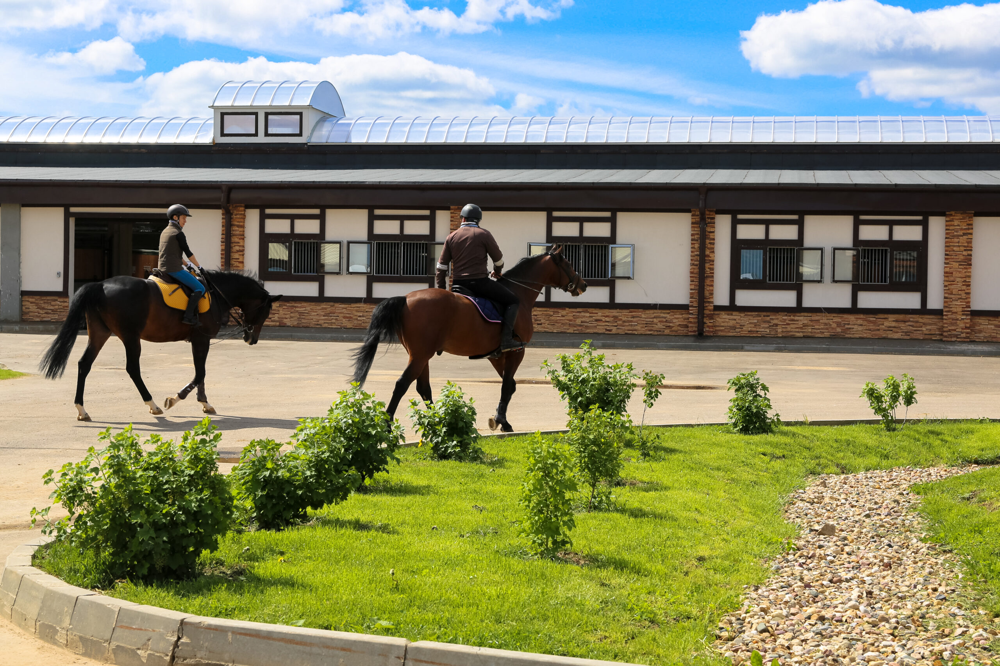

# Добро пожаловать в КСК «Аллюр» 🐴

##  📸 О нас

**Конно-спортивный клуб «Аллюр»** — это место, где лошади и люди находят общий язык.  
Мы находимся в **г. Ангарск** и уже более **10 лет** помогаем любителям лошадей  
осваивать верховую езду, участвовать в соревнованиях и просто отдыхать душой.

---

## 🎯 Чем мы занимаемся

- 🏇 **Обучение верховой езде** — для детей и взрослых
- 🐎 **Прогулки на лошадях** — по лесу и полям
- 🏆 **Спортивные тренировки** — подготовка к соревнованиям
- 👶 **Иппотерапия** — реабилитация через общение с лошадьми
- 🎉 **Праздники и фотосессии** — незабываемые впечатления

---

## 🌟 Почему выбирают нас

1. **Опытные инструкторы** — стаж более 10 лет
2. **Спокойные и обученные лошади** — безопасность превыше всего
3. **Живописные маршруты** — прогулки по лесу и полям
4. **Доступные цены** — занятия для всех

---

## 📞 Запишитесь на занятие

Позвоните нам: **+7 (3955) XX-XX-XX**  
Или напишите: **ksk_allyur@mail.ru**

---

## 🔗 Полезные ссылки

- [О клубе](about.md)
- [Наши услуги](services.md)
- [Наши лошади](horses.md)
- [Как нас найти](contacts.md)
