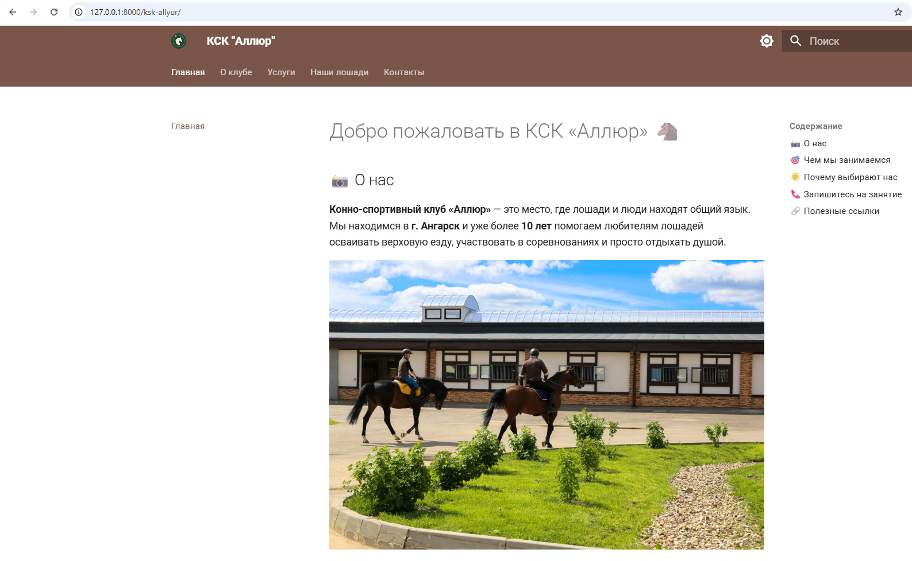
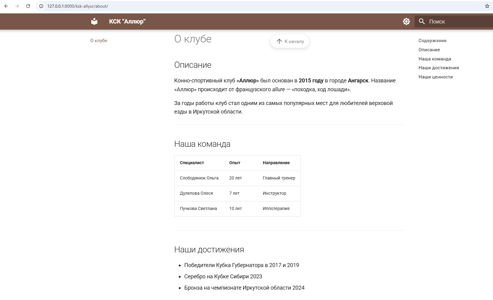
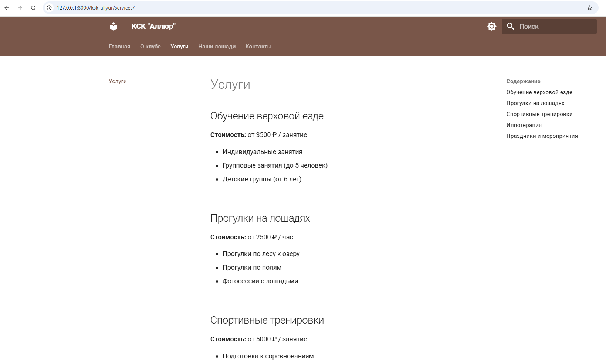
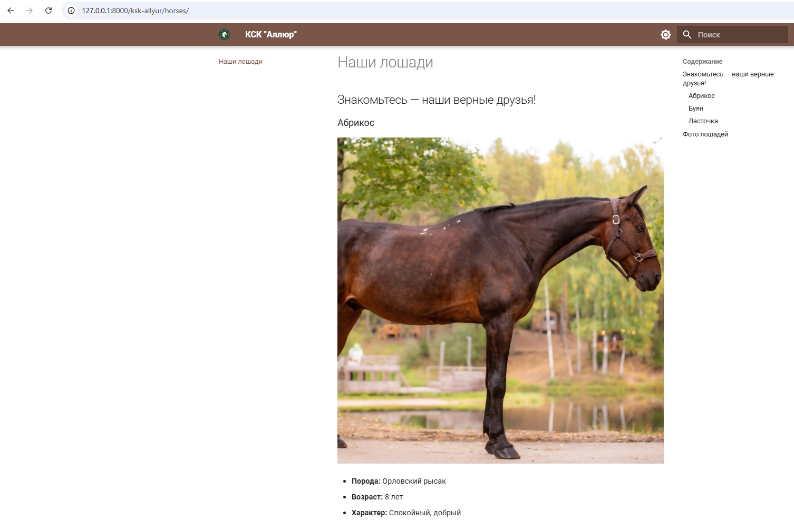
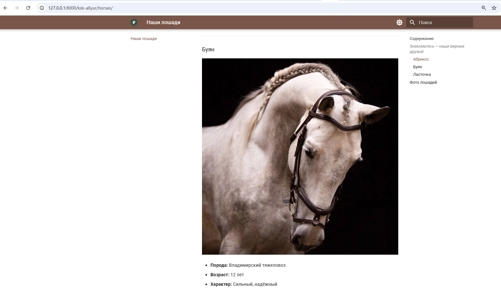
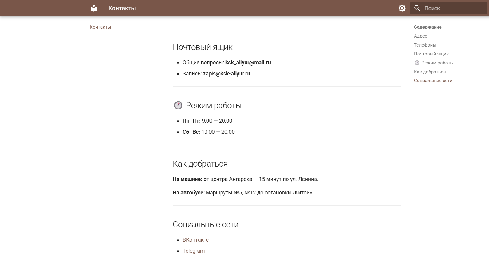
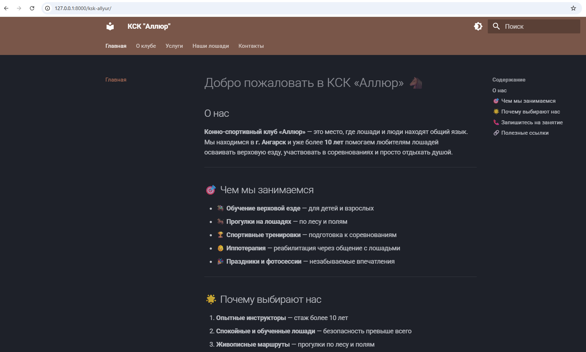
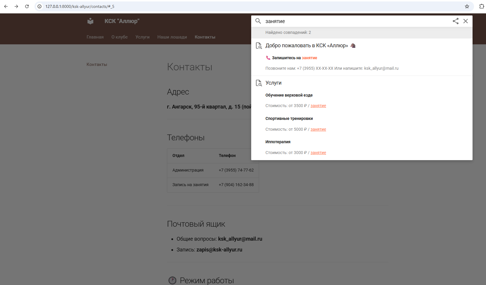

University: [ITMO University](https://itmo.ru/ru/)

Faculty: [FICT](https://fict.itmo.ru)

Course: [Введение в веб технологии](https://itmo-ict-faculty.github.io/introduction-in-web-tech/)

Year: 2026/2027

Group: U4125

Author: Popinova Ekaterina Dmitrievna

Coursework: Coursework1

Date of create: 18.09.2026

Date of finished: XX.09.2026

## Отчёт по курсовой работе
**Название курсовой работы:** "Создание сайта с использованием MkDocs"

**Цель работы**:
Создать сайт организации с использованием MkDocs и языка разметки Markdown.

**Ход работы**:

**1. Установка**

python -m pip install mkdocs mkdocs-material

**2. Создание проекта**

mkdir my-personal-site

cd my-personal-site

python -m mkdocs new .

**3. Настройка mkdocs.yml**

site_name: КСК "Аллюр"

site_description: Страница организации

site_author: Попинова Екатерина

Тема: Material

Цвета: brown + deep orange

Features: navigation.tabs, navigation.sections, navigation.top, search.highlight

Соцсети в футере: VK, Telegram

**4. Созданные страницы**

Главная	index.md

О клубе	about.md

Услуги	services.md

Наши лошади	horses.md

Контакты	contacts.md

Элементы Markdown: заголовки, списки, таблицы, ссылки, изображения, эмодзи.

**5. Изображения**
Создана папка docs/images/, добавлены картинки.

**6. Тестирование**
python -m mkdocs serve

Сайт: http://127.0.0.1:8000/ksk-allyur/

Проверено: все страницы, навигация, поиск, переключение тем

**Выводы**:
Освоен MkDocs — инструмент для создания статических сайтов из Markdown. Настроена тема Material, создан многостраничный сайт с навигацией, поиском и адаптивным дизайном. Сайт опубликован на GitHub Pages.

## Скриншоты

### 1. Главная страница

### 2. Страница «О клубе»

### 3. Страница «Услуги»

### 4. Страница «Наши лошади»

### 5. Страница «Контакты»

### 6. Тёмная тема

### 7. Работа поиска

